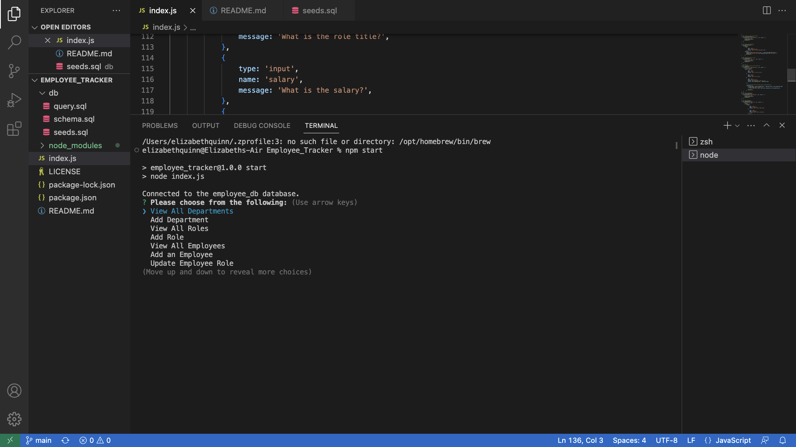
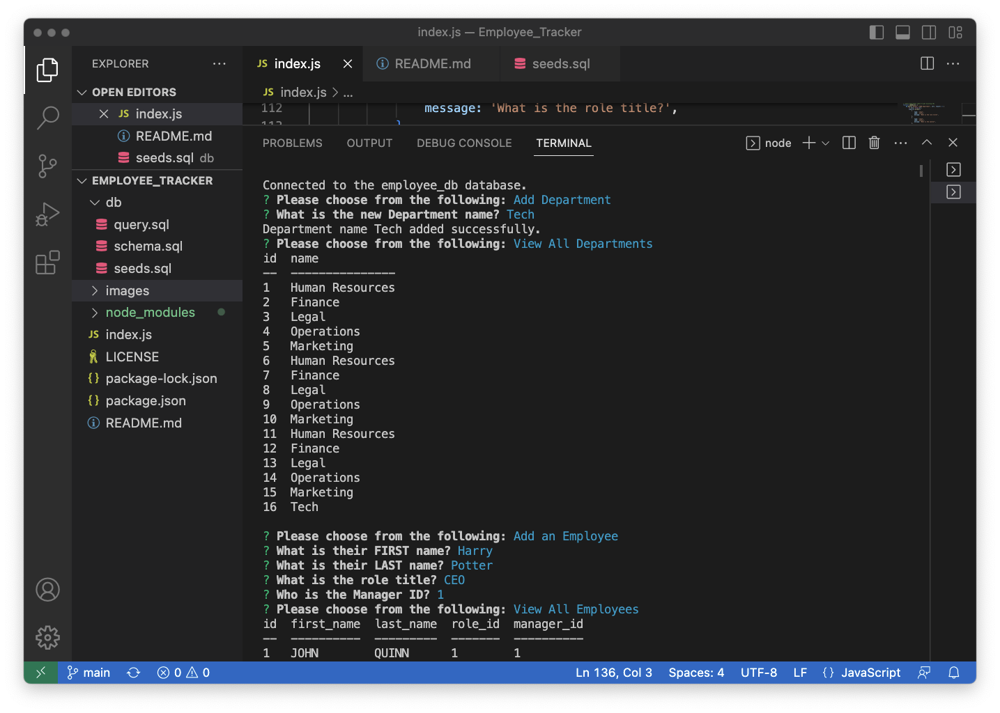

# SQL Employee Tracker

## Description
To build a command-line application from scratch to maange a company's employee database, using Node.js, Inquirer and MySQL. 

## Installation
1. Clone the GitHub repository.
2. Navigate to the project directory. 
3. Install the required dependencies by running the following command. 
```m
npm install
```

## Usage
Set up your MySQL database and update the database credentials in the config.js file.
Run the application by executing the following command:
```m
node index.js
```
The application will display a menu with the following options:
- View All Departments
- View All Roles
- View All Employees
- Add a Department
- Add a Role
- Add an Employee
- Update an Employee Role
Select an option using the arrow keys and press Enter to proceed.
Follow the prompts to perform the desired action.
The application will provide feedback and display the requested information or confirm the successful completion of the operation.


## Credits
Tutor: Sheetal 
Tutor: Micky


## License
MIT License 

## Screen Shots



## Video Walk Through
[YouTube Video Walk Through](https://youtu.be/juL1n4Sj9Yk)

